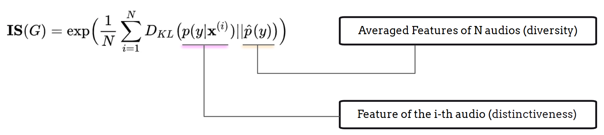

# Evaluation

We present **Evaluation** before discussing model architecture because, in a generation task, it is crucial to understand the objective metrics that assess diversity, overall quality, relevance, and other aspects of music generation performance. Additionally, recognizing the limitations of these objective metrics and complementing them with subjective evaluation methods is invaluable, as the ultimate assessment of music generation relies on **listening** rather than numbers.

## Listening Test

The subjective listening test is the most effective method to evaluate the performance of music generation models.  Drawing from techniques used in speech generation, two commonly applied methods in the subjective listening tests for audio generation are the Mean Opinion Score (MOS) {cite}`musicgenerationtemplate` and MUSHRA (Multiple Stimuli with Hidden Reference and Anchor) {cite}`musicgenerationtemplate`. These methods provide valuable insights into listener perceptions and the overall quality of generated music.

### MOS Test (Mean Opinion Score)

The purpose of the MOS (Mean Opinion Score) test is to evaluate the overall quality of a **single audio stimulus**. This method has been widely used in text-to-speech generation tasks {cite}`musicgenerationtemplate`, as well as in telecommunications and audio codec systems. The setup for a MOS test is cost-effective and straightforward, where testers rate each audio stimulus on a scale from 1 (poor) to 5 (excellent) based on their perception of audio quality or other specific criteria.

One of the strengths of the MOS test is its suitability for situations where the overall subjective quality of a single audio piece needs to be assessed, rather than comparing different models or systems. However, the weaknesses lies in its feedback, which is less sensitive to small quality differences between audio stimuli, and it does not provide insights into the reaons behind the rating. 

### MUSHRA Test (Multiple Stimuli with Hidden Reference and Anchor)

Unlike the MOS test, the MUSHRA test is considered a more advanced method for the detailed evaluation of multiple audio stimuli and systems.

The MUSHRA setup requires testers to listen to several versions of the same audio signal, including a high-quality reference (hidden reference) and a lower-quality version (anchor). Testers rate each stimulus on a continuous scale from 0 (poor) to 100 (excellent) based on perceived audio quality. The MUSHRA test is often designed to evaluate different model ablations, particularly when the differences are subtle.

One of the strengths of MUSHRA is its ability to provide a more detailed and sensitive evaluation of quality differences between audio stimuli and different models. The inclusion of a reference and an anchor helps ensure that participants can offer more accurate responses. However, a notable weakness of MUSHRA is its design complexity; it is more elaborate and time-consuming compared to the MOS test. Additionally, since participants typically evaluate multiple stimuli for each audio sample in a MUSHRA test, this can lead to fatigue during long sessions.

## Audio Diversity and Quality

In addition to subjective listening tests, researchers have developed several objective metrics to evaluate generation performance from a statistical learning perspective. These metrics, originally derived from image generation tasks, include the Inception Score (IS) {cite}`musicgenerationtemplate` and the Fréchet Inception Distance (FID) {cite}`musicgenerationtemplate`.

### Inception Score

The Inception Score (IS) is designed to evaluate the diversity and distinctiveness of outputs generated by generative models. To calculate the Inception Score, a representation model, such as VGGish {cite}`musicgenerationtemplate`, PANN {cite}`musicgenerationtemplate`, or CLAP {cite}`musicgenerationtemplate`, is required to create effective embeddings. The calculation process can be summarized in the following steps:

1. Use a pretrained representation model to obtain deep neural embeddings for each generated output;
2. Calculate the average embedding of all generated outputs;
3. Compute the Inception Score using the Kullback-Leibler (KL) Divergence between the embeddings:

The first term of the KL Divergence represents the entropy of the embedding distribution, serving as an effective indicator of classification results. A high IS indicates that each embedding is distinct, as the representation model can confidently assign a unique label to each generated output.

The second term reflects the evenness of the embeddings. When the IS is high, this indicates the desideatum that the generation outputs considers all possible types of audio which reflect a flat distribution. 

### Fréchet Inception Distance (FID/FAD)

The Fréchet Inception Distance (FID) {cite}`musicgenerationtemplate`, adapted for the audio domain as the Fréchet Audio Distance (FAD) {cite}`musicgenerationtemplate`, provides a comparable result based on the Inception Score, which was adopted into the audio domain as Fréchet Audio Distance (FAD) {cite}`musicgenerationtemplate`. The calculation process can be summarized in the following steps:

1. Use a pretrained representation model to obtain deep neural embeddings for both the generated outputs and **the data points in the reference set**;
2. Caculate the average embedding of all generated outputs, the average embedding of reference data, the co-variance matrix of all generated outputs, and the co-variance matrix of reference data;
3. The FID/FAD is then computed using these values:

The key difference between IS and FID/FAD is that while IS evaluates the distribution of generated outputs, FID/FAD compares this distribution against that of real data, providing a more comprehensive measure of generation quality.

## Text Relevance

In the text-to-music generation task, it is essential to assess the correspondence between the generated output and the reference textual input to evaluate the performance of multi-modal learning and generation. The CLAP Score {cite}`musicgenerationtemplate` is commonly used for this purpose, leveraging a contrastive language-audio pretraining module:

1. Use the pretrained CLAP model to obtain embeddings for both the generated audio and the reference text;
2. Calculate the dot product or cosine similarity for each text-audio pair and average their scores to derive the final CLAP score.

Additionally, the cosine similarity between the generated audio embedding and the reference audio embedding can also be useful for assessing the audio quality and diversity of the generative model. This metric can be integrated into the calculations for IS and FID/FAD scores.

## Limitation

The limitations of IS, FID/FAD, and the CLAP score can be summarized in three key areas:

1. Embedding Effectiveness: All scores are entirely dependent on the effectiveness of the representation models used. Therefore, selecting an appropriate and effective representation model for calculating embeddings is crucial. Additionally, understanding the limitations of these models can help identify potential corner cases.

2. Distribution-Level Matching: IS and FID/FAD are based on the divergence between the distribution of generated outputs and the average output or the reference data. A high score typically indicates superior quality and diversity, but it can be misleading if the model is able to "cheat" the evaluation. Conversely, a low score does not necessarily indicate poor quality or diversity; the distribution of generated outputs can just be biased to the reference distribution, which may still reflect good quality.

Given these limitations, it is highly recommended to combine both subjective and objective metrics when evaluating music generation models.

