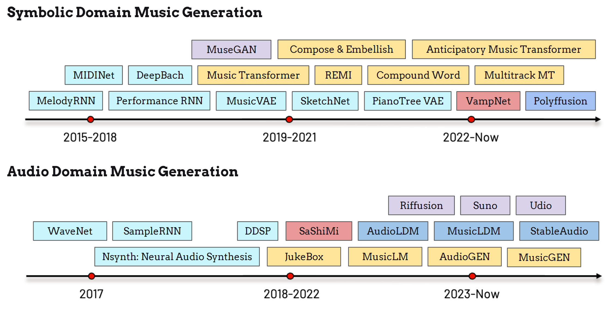
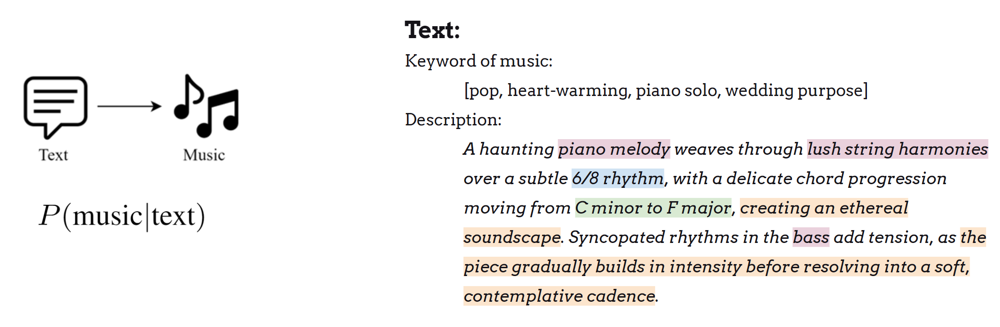

# Introduction

## History

The music generation task can be retreived into a long history back to 1950s {cite}`lamere2008social` as algorithmic composition. At around 1990s, researchers applied neural networks for symbolic music generation {cite}`lamere2008social`. On the other side, the real-time interactive art creation also inolves the music accomponniment work {cite}`lamere2008social`. 

Begininng on 2015, the exploration of deep-learning models in symbolic and acoustic music generation has thrived, as demonstrated by the timeline in the above figure. Researchers at Google adopted the recurrent neural network (RNN) {cite}`lamere2008social` into the melody generation task, where the melodic notes are enocded as different states of pitch and duration to allow the model to predict {cite}`lamere2008social`. MidiNet {cite}`lamere2008social` and  Performance RNN {cite}`lamere2008social` furthre improved the generative performance of the model in terms of the articulation and expressivenss. The style transfer of the specifc music composers are futhre archieved in DeepBach {cite}`lamere2008social` for the Bach-Style chorale music generation under Sony CSL. Thanks to the breakthroughs in deep generative models {cite}`lamere2008social`, three types of symbolic music generative models, namely MuseGAN {cite}`lamere2008social`, Music Transformer {cite}`lamere2008social`, and MusicVAE {cite}`lamere2008social` emersed almost the same time around 2018-2020. After that, many correspondings works follow their architectures to focus on the higher quality, efficient performance, and better controllability of the symbolic music generative moedel, including REMI {cite}`lamere2008social`, SketchNet {cite}`lamere2008social`, PianotreeVAE {cite}`lamere2008social`, Multitrack Music Transformer {cite}`lamere2008social` and others. 

Recently, by the development of diffusion model {cite}`lamere2008social` and the masked generative model {cite}`lamere2008social`, new paradigms of the symbolic music generative models, such as VampNet {cite}`lamere2008social` and Polyfussion {cite}`lamere2008social`, are established to give more inpsirations and possiblity of the symbolic music generations. Meanwhile, taking the advantages of the language model architectures, Anticipatory Music Transformer {cite}`lamere2008social` yields descent performance on a wide range of the symbolic music generation.

Comparing to the symbolic music domain, the audio domain music generation, which aims at producing the music signals directly as the output, faced the challenges in the generation quality in the early stage, when the limitation of data, model architectures, as well as the computation efficiency impeded its developments. The early exploration of the audio generation mainly lay in the speech generation, as marked by WaveNet {cite}`lamere2008social` and SampleRNN {cite}`lamere2008social`. Nsynth {cite}`lamere2008social` was regarded as the first work to synthesize the musical signals performed by Google Mangenta Team, which evolves to DDSP {cite}`lamere2008social` later. OpenAI published a remarkable music generation model, JukeBox {cite}`lamere2008social`, which first create descent music signals directly from the model instead of the syntheization tools from the symbolic music notes. Then, SaShiMi {cite}`lamere2008social` leverages the structure state model S4 {cite}`lamere2008social` to participate in this challenge. Recently, Latent Diffusion Model are applied recently into the audio generation task, including AudioLDM {cite}`lamere2008social`, MusicLDM {cite}`lamere2008social`, Riffusion {cite}`lamere2008social`, and later StableAudio {cite}`lamere2008social`. On the other side, the langugae model also thrives in this task by the development of AudioGen {cite}`lamere2008social`, MusicLM {cite}`lamere2008social`, and MusicGen {cite}`lamere2008social`. Text-to-Music becomes a hot topic in the recent period in the field of generation task and multi-modal learning task. This breakthrough is also led by the powerful models from the startup companies, such as Suno {cite}`lamere2008social`, and Udio {cite}`lamere2008social'.

In this tutorial, we focus on the audio domain music generation task, specifically on the **text-to-music generation task**. as it is more corresponded to the traditional signal-level-based music understanding, music retrieval tasks, as well as its combination to the natural languages. 

## Problem Definition

The definition of the text-to-music music generation is demonstrated in the above figure, where the model is trained to learn a general probabilty function music target given the textual input. The figure showcases an example of the textual description types. Simply, the description can be a series of keywords on music, such as genre, emotion, instrument, and purpose. A more complex input can be presented as text sentenses, which comprises of different muscial information such as instrument assignment (pink), key and time signature (blue and green), and clichés (yellow). We expect the model to encode the textual information correctly and reflect them in the output generation. 

In the follows sections, we will introduce this topic by first introducing the evaluation of the music generation. Then we go through two representative types of text-to-music models, Autoregressive LM-based architecture (MusicGen {cite}`lamere2008social`), and Non-autoregresstive Diffusion-based architecture (StableAudio {cite}`lamere2008social`). Finally, we will discuss some philosophies and limitations on the current text-to-music models, in order to achieve better interaction between machine creations and human beings.   