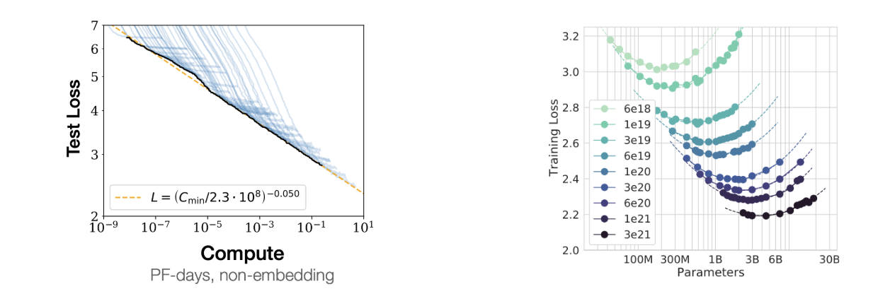

# Advances

In the previous section, we introduced language modeling as a powerful machine learning framework for learning the mapping between any inputs and outputs:

In this section, we identify a few limitations of using this framework and their solutions.

### Limitations

While this framework is really powerful, in practice, it of course comes with a variety of limitations. The table below lists some of those limitations and how the field has been addressing each of them.

| Limitation | so it’s difficult to … | but we can … | Solution
|:---------:|:---------:|:---------:|:---------:|
| It’s a generative model | use for discriminative tasks | use probes or fine-tune on each task | Transfer learning |
| It generates nonsense	| use the model| use more data / bigger Transformers | Scaling |
| Now it’s is too huge and slow | generate quickly and cheaply | distill a small model from a large one | Distillation |
| It doesn’t behave as desired | use as a helpful assistant | fine-tune for human preference | Post-Training / RLHF |
| Its context is limited | work with larger search spaces | query external sources for more context | RAG / Tool Use / Function Calling |
| Multimodal data is huge | hard to use as condition | use an encoder, e.g. CLIP and Whisper | Multimodal Encoders |
| Outputs have to be discrete  | sample continuous data | use a VQ-VAE and/or diffusion | Multimodal Decoders |
| Constant compute per token | make it think deeper when needed | make the model think step-by-step | Chain-of-Thought Reasoning |

As you can see, each of these limitations opens a whole literature of research areas surrounding language models. In the following, I will briefly introduce each of these topics and related research progresses.

##### Transfer Learning from Language Models

Once we have a trained language model that gives us a probability distribution of tokens, we can sample some texts and play with it, but how about other kinds of tasks, such as discriminative tasks like classification? This brings us to **Transfer Learning**.

The tasks that we train language models for, such as next-token prediction or filling in the blanks, are called **pretext tasks**, in a sense that they aren’t necessarily the final goal but are useful for learning general representations of language.
So the language models trained this way not only can just generate completions for any given prefix, but also have learned a lot about language structure, patterns, and semantics, that we can make use of.

To do that, we can replace the last layer of the model with a task-specific head, reusing the base part of the model. This head is fine-tuned for the task at hand, while the base model itself can be either updated or frozen, depending on the task and the amount of data we have.

This transfer learning process allows us to leverage the model’s learned representations and apply them flexibly across a wide range of applications, often with minimal task-specific data.

##### Zero-shot Task Transfer and In-Context Learning

When we have a powerful enough generative model, we don’t necessarily have to fine-tune the model for each specific task. We can simply prompt the generative language model with a task description—like `translate English to German:` or `summarize this paragraph`, and it will continue with a response based on its pre-existing knowledge.

This approach is called zero-shot task transfer, and it allows us to skip the fine-tuning stage entirely and use the model for various text-to-text tasks without any additional training.
Classification or regression tasks can also be formatted as a text-to-text task, for example by including all multiple-choice options in the prompt with `A.` `B.` `C.` `D.` prefixes and making the model continue with the letter corresponding to the correct answer.

We can also provide a few examples of the task at hand directly in the prompt, to contextualize the model into the mode of solving that specific task. For example, we might provide a few English-to-French translation pairs to help the model recognize the task pattern and provide better translations. This is called **few-shot learning** because the model can adapt quickly from just a few examples of task-specific training data, and the capability of learning the task directly from the prompt without having to fine-tune the model at all is called **in-context learning**.

These realizations happened as we scale up language models from above one billion of parameters in GPT-2, to above ten billion parameters in T5, and above hundred billion parameters in GPT-3, popularizing the term large language models or LLMs. Why do these capabilities “emerge” as we scale up the model?

##### Scaling Laws of Language Models

We don’t have a perfect answer for why some emergent capabilities show up at certain scale, but these development brings us to an important concept: the Scaling Laws of Language Models.

Neural networks can be scaled up by adding more layers, channels, or parameters, which often translates into better performance. Researchers have empirically found that, increasing the amount of compute used in training has a predictable effect on reducing the loss. Essentially, by scaling up compute resources, we can achieve lower error rates and improved generalization.

The graph on the left illustrates that as we increase the compute budget, the test loss continues to decrease, and their pareto frontier is a straight line in a log-log plot, which indicates a power-law relation.

The second plot from the Chinchilla paper shows that for a fixed amount of compute budget, there is an optimal model size and the dataset size that achieve the lowest loss. In the LLM jargon, this size is called Chinchilla-optimal.

The graphs above only concern the training compute, but in practice, significantly more compute resources can be needed for inference, since the model can be used by millions of users after being trained just once. For this reason, language models are often trained for a lot longer than the Chinchilla-optimal point, because having a smaller model that achieves the same performance can save a lot of inference compute, even if it costs more for training.

##### Distillation of Language Models

As we alluded above, it is often the situation where scaling up language models helps, but we want smaller models in practice for faster inference and lower cost.
**Knowledge distillation** is a promising method for obtaining a small, “student” model that can perform as well as a big, “teacher”  model.
This is possible because the teacher model can provide richer supervision than just the training data, such as the logits for all probable tokens during prediction, not just the discrete one-hot label that the training data can provide.

More recently, the term distillation also refers to the process of training on the outputs sampled from a more “intelligent” or bigger model, because the outputs from those models are sufficiently high-quality and large-volume compared to what’s available otherwise. A good example of this is distilling from the outputs of the GPT-4o model for a certain task, where the customers can train a GPT-4o mini model on those outputs and save costs when using the model for that specific task.

##### Aligning Language Models with Human Feedback

Because autoregressive language models are just trained to generate continuations, it doesn’t always follow our intention. For example, if we prompt the model with a question, it may answer the question, or continue with a bunch of related questions.

We discussed few-shot learning as a remedy, which provides a few examples in the prompt that follow the desired behavior,
but a more effective way to make the model behave in the way we want is introduced in the InstructGPT paper, called **RLHF**, or **reinforcement learning from human feedback**.
This is a three-step process of fine-tuning the pretrained language model to align with our desired behavior.

- **Step 1: Supervised Fine-Tuning (SFT)** – First, we collect demonstration data. For example, we might ask human labelers to generate responses for certain prompts, showing the model what the desired output behavior looks like. This supervised data is then used to fine-tune the model, which creates a baseline that generally reflects human preferences.
- **Step 2: Reward Modeling (RM)** – we then collect comparison data by showing human labelers several model outputs for the same prompt and asking them to rank these responses from best to worst. This data is used to train a separate reward model, that can evaluate and provide reward scores on model outputs showing how closely they align with human preference.
- **Step 3: Proximal Policy Optimization (PPO)** – we use reinforcement learning, specifically Proximal Policy Optimization, to adjust the model’s behavior to maximize the reward of its outputs, based on the reward model that we trained in the previous step.

The central idea of RLHF is to view a language model not just as a text continuation model but a policy in the reinforcement learning context that goes through a multi-step markov decision process of generating a token at each step, and in the and receives a reward signal based on how good the entire response is.
The intuition is that this process allows the model to be fine-tuned more holistically to match human preference, more than just doing a supervised fine-tuning which optimizes for getting the next-token prediction correct.

A more recent method called **direct preference optimization or DPO** is an alternative method to RLHF, which does not involve reinforcement learning but still optimizes for a mathematically equivalent objective as RLHF. DPO was used for fine-tuning LLaMA 2 and LLaMA 3.

This overall process is called **post-training**, because it happens after pre-training the base model and before shipping the language model as a product which requires the model to be aligned with human preferences.

##### Retrieval-Augmented Generation (RAG)

Another challenge in using language models is that they can only generate responses based on the data they were trained on, which means they might lack up-to-date or specialized information.
To address this, we can include new relevant information in the prompt, as we discussed regarding few-shot learning and in-context learning, but the context length of a language model is limited.

This is where **Retrieval-Augmented Generation (RAG)** comes in as a powerful approach.
RAG enables the model to search for relevant information from external sources—such as a knowledge base, recent news articles, or an internal database of a company—and incorporate this information into its response, even when such information was not in the training dataset.

The process works as follows:

1.	The user submits a query, which is first processed by a retriever.
2.	The retriever searches a knowledge base or database for the most relevant information. This retrieval step can use various methods, such as embedding similarity or full-text search, to find the best matches.
3.	The retrieved information is then added to the model’s context, allowing the generation step to produce an informed response based on both the query and the retrieved information.

RAG can make the model less prone to hallucinations—or generating inaccurate information— and also makes it easier for it to correctly reference the sources of its outputs, something that pure LLM generations often struggle with.
The performance RAG is limited by the accuracy and the latency of the retrieval system, so compared to LLM-only generation, it becomes more challenging to get every component of this system to work accurately.

##### Tool Use and Function Calling

Tool use and function calling is a natural extension to Retrieval-Augmented Generation (RAG).
While RAG allows models to retrieve relevant information, some tasks require real-time data, precise calculations, or specialized functions that go beyond retrieval.
With tool use and function calling, language models can dynamically call external tools—such as calculators, web searches, code interpreters, or APIs—to enhance their responses.

When a user submits a query, the model can decide whether it needs to invoke a specific tool, determined by whether it samples a special token that indicates it should use a tool or call a function.
If so, it dispatches a call to the relevant tool, retrieves the result, and integrates it into the response.
This capability enables models to go beyond static knowledge and also to make changes to the external world by executing code or calling APIs.

In ChatGPT or Claude, you can make it execute the code it generated and show the results, or more recently, you make the LLM take control of a virtual desktop computer and perform tasks using it.
This is enabling the emergent field of LLM agents, and it is an open challenge to make multiple intelligent agents to interact with each other and achieve complex goals.

##### Multimodal Encoders for Language Model Inputs

To incorporate image or audio data into language models, we can use multimodal encoders.

The idea is to feed image or audio embeddings, instead of just word embeddings, into the model.
The encoder can be anything, from supervised, self-supervised, or contrastive model, as long as it can provide a good representation for that modality.
A common choice is to pick from openly available pre-trained models, such as CLIP for image inputs and Whisper for speech inputs.
Alternatively, the encoder can also be trained from scratch, although it generally requires more computational resources and data.

Multimodal language models allow inputs that have texts, images, and audio interleaved, and the language model takes the encoded features of multimodal inputs. 

The Flamingo model used cross attention to attend on image features, but it can be any other form of conditioning. We can be very flexible with conditioning inputs, as we saw earlier.

##### Multimodal Decoders for Language Model Outputs

But for multimodal outputs, we need to be more clever.
Unlike with text, typical language models can only generate discrete tokens, which isn’t ideal for images or audio.
To handle this, we have a few approaches.

An early approach is to predict discretized pixel or amplitude values directly, as in models like ImageGPT for images or WaveNet for audio.
A more common method recently is to use vector-quantized variational autoencoders (VQ-VAEs), which allow the model to generate sequences of discrete codes that represent an image or audio signal, as seen in DALL-E. These codes are then decoded back into the original modality.

However, VAE outputs can sometimes be blurry, so to improve quality, we often use GANs or diffusion models as better VQ decoders—as in VQGAN, Encodec, or Sora. 

[Later in this tutorial](../generation/diffusionmodel.html), Zackery and Ke will talk more on this direction of approaches for music generation.

##### Chain-of-Thought Reasoning of Language Models

Language models often produce quick answers without thinking through the problem, or spending more compute proportional to the difficulty of the given problem, which can lead to incorrect responses, especially on complex questions.
**Chain-of-Thought (CoT) prompting** addresses this by encouraging the model to reason step-by-step.

In CoT prompting, we give the model examples with in-context reasoning, such as samples of step-by-step solutions to math problems.
In the example on the left, the language model fails to solve a math problem when prompted with a simple list of questions and answers in the context,
but it correctly solves the problem when the in-context examples included step-by-step reasoning.
Interestingly, it’s also been shown that by just adding “Let’s think step by step” leads to more accurate results, without having to provide any in-context few-shot examples.

Going further than just clever prompting, we can use reinforcement learning to optimize the model to generate better chains of thoughts that are more likely to arrive at the correct answer. This is the basic idea behind the recent OpenAI o1 model, where we showed that the model’s performance predictably increases as the model spends more compute for sampling longer chains of thoughts, hinting at the scaling law of inference-time compute, which can orthogonally improve language models on top of the train-time compute.

